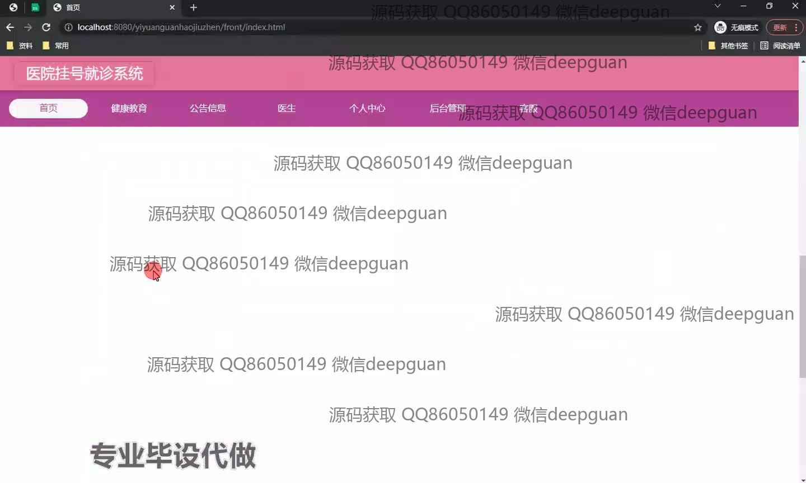
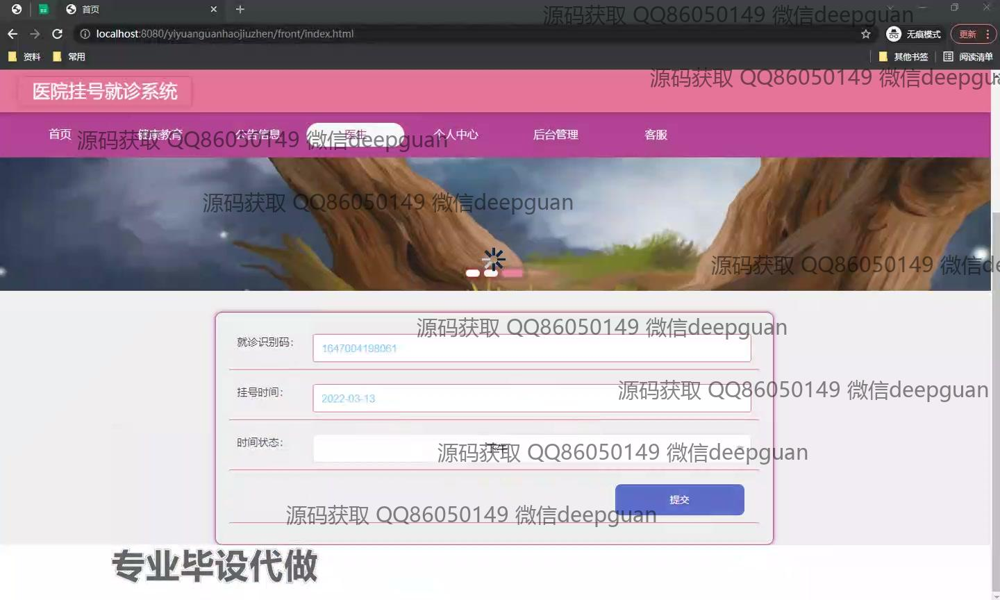
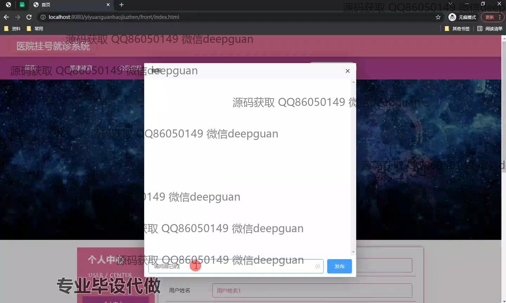
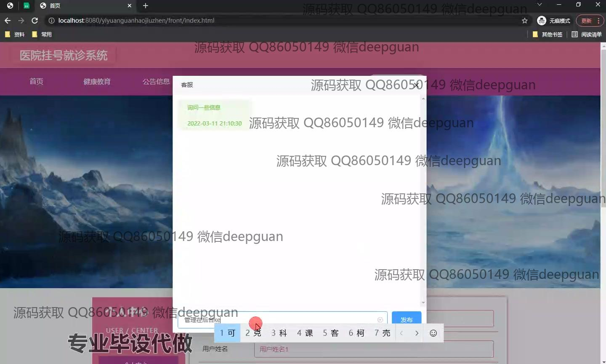
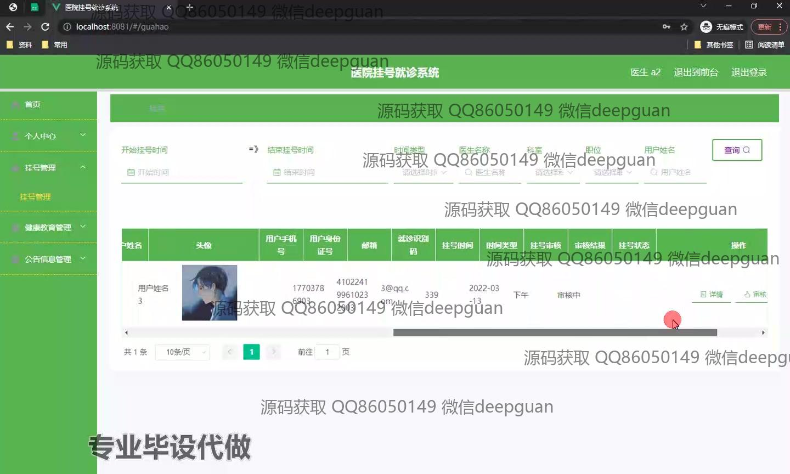
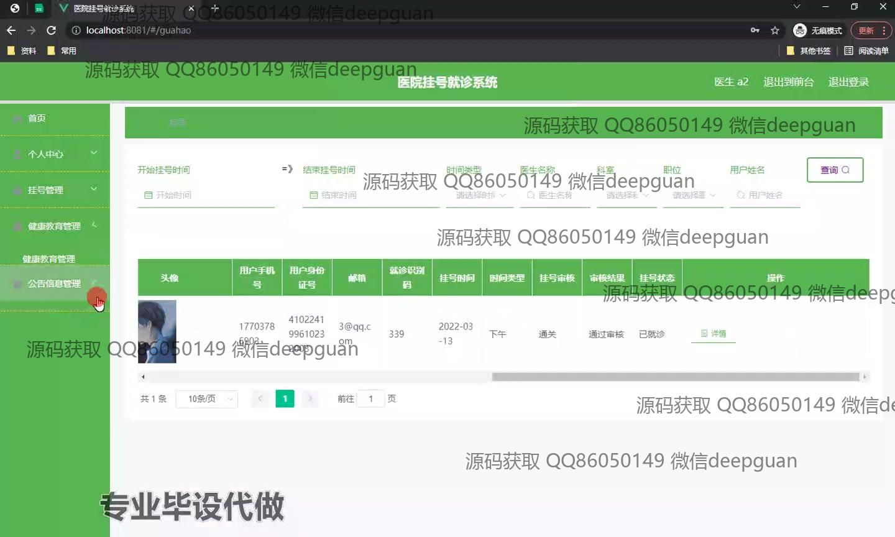
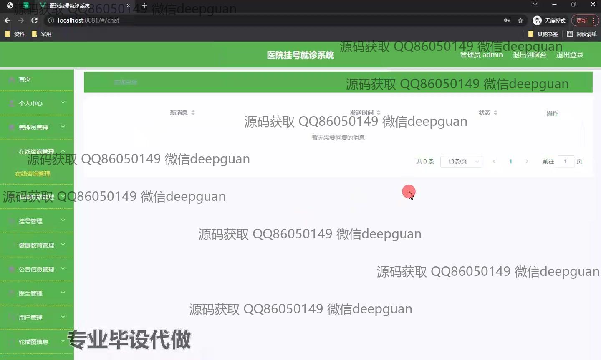
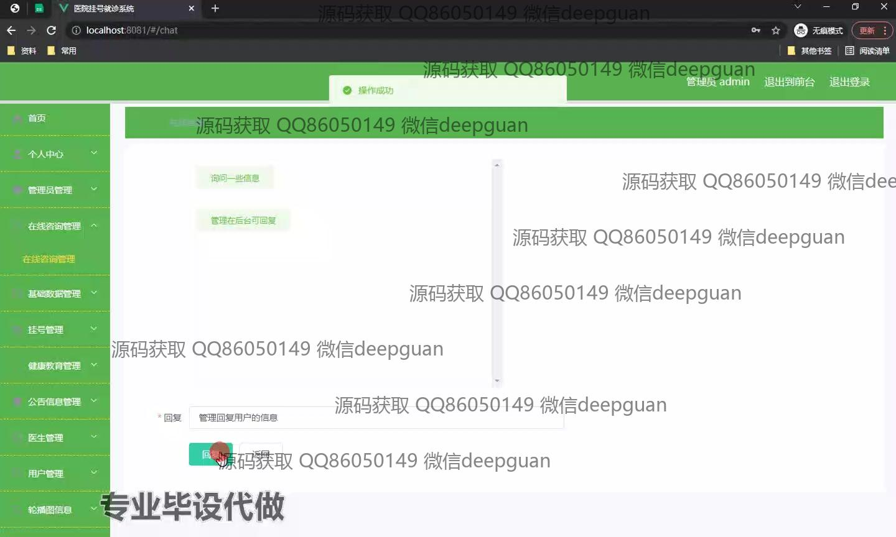
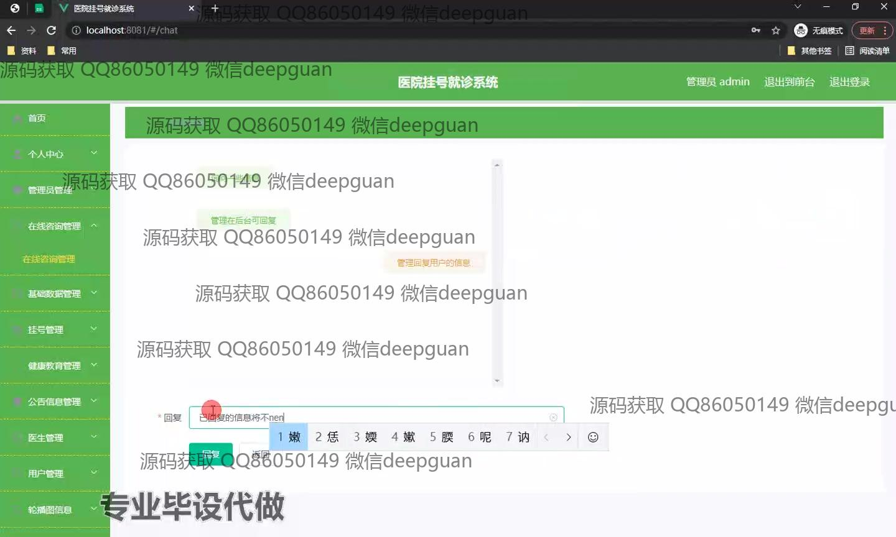

<h1 align="center">基于spring boot的医院挂号就诊系统</h1>

## 简介
医院挂号就诊系统：提供用户和管理员角色，拥有首页、个人中心、公告信息管理、在线咨询管理、挂号管理、健康教育管理、医生排班查询和支付功能，旨在提升医院管理效率和用户的就医体验。    --计算机毕业设计源码；毕设源码；java毕业设计源码

## 联系方式

<h3 align="center">获取完整代码与数据库文件 + 微信：deepguan QQ: 86050149 QQ群: 783742310</h3>

<h3 align="center">可帮忙远程部署 包运行成功！提供远程部署、修改代码、设计文档指导、代码讲解等服务！</h3>

## 功能介绍（完整见运行截图）
医生：医生管理界面功能包括医生排班查询和与患者的在线咨询交流，并且可以通过系统查看每日挂号情况和咨询信息。医生还能够进入健康教育模块，查看并参与健康教育内容的更新与管理，以提升患者的健康知识水平。

患者：患者可以通过系统进行个人信息的查看和修改，使用预约挂号功能浏览医生的可用时间并预定合适的就诊时间。此外，患者能够在个人中心管理已登记的挂号信息，查看历史就诊记录，通过在线支付完成费用结算，并参与健康教育信息的学习。

管理员：管理员拥有对用户和医生信息、挂号、和健康教育内容的管理权限。他们可以通过后台管理功能来添加、修改或删除公告信息和对在线咨询进行跟进与回复。系统中提供的统计报表功能帮助管理员分析患者挂号数据和就诊趋势，提高运营效率。

客服：客服主要通过对话框功能与患者在线交流、解答疑问，帮助患者解决在使用系统时遇到的问题。他们能够查看患者咨询的记录，与其他模块的导航条相结合，并在需求时引导患者到相关功能模块获取帮助与操作。

## 运行截图

本代码来源于网络,仅供学习参考使用!

